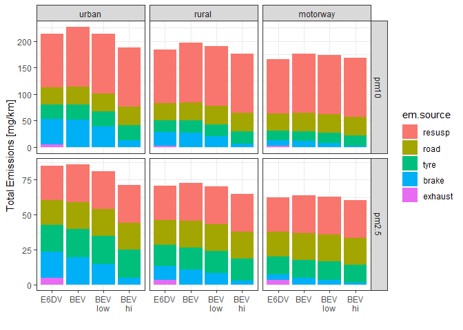

<!-- index.md is generated from README.Rmd. Please edit that file -->

# embrs

<!-- badges: start -->
<!-- badges: end -->

> **embrs** is in development

**embrs** was initially written as part of work on a scoping exercise to
provide early estimates of the environmental impacts of the diesel to
electric bus transition.

## code sources

**embrs** code sources: <https://github.com/karlropkins/embrs>

## Installation

You can install the development version of embrs from
[GitHub](https://github.com/) with:

``` r
# install.packages("devtools")
devtools::install_github("karlropkins/embrs")
```

## Example

**embrs** uses vehicle and route objects to build small-scale emission
inventories:

``` r
library(embrs)
# some buses
# a ICE diesel bus weighing 15925 kg
bus.1 <- bus_ice(name="E6DV", veh.wt=15925) 
# a battery electric bus weighing 17725 kg (and conventional brakes) 
bus.2 <- bus_bev(name="BEV", veh.wt=17725) 
# like bus.2 but with regenerative brakes operating at 25% efficiency
bus.3 <- bus_bev(name="BEV\nlow", veh.wt=17725, brk.regen = 0.25) 
# like bus.3 but 75% efficiency
bus.4 <- bus_bev(name="BEV\nhi", veh.wt=17725, brk.regen = 0.75)  
# a small fleet
fleet <- bus.1 + bus.2 + bus.3 + bus.4
# some routes 
routes <- route_naei_urban() + route_naei_rural() + route_naei_motorway()
# an inventory
inventory <- fleet * routes
plot(inventory)
```



## Contributing

Contributions are very welcome. Please see both [contribution
guidance](https://karlropkins.github.io/embrs/CONTRIBUTING.html) and
[code of
conduct](https://karlropkins.github.io/embrs/CODE_OF_CONDUCT.html) if
interested in contributing.

## License

[GPL-3](https://karlropkins.github.io/embrs/LICENSE.html)
