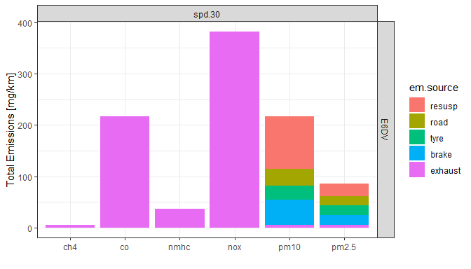

<!-- index.md is generated from README.Rmd. Please edit that file -->

# embrs 

<!-- badges: start -->
<!-- badges: end -->

> **embrs** is in development

**embrs** was initially written as part of work on a scoping exercise to
provide early estimates of the environmental impacts of the diesel to
electric bus transition published as [Tivey et al
2023](https://doi.org/10.3390/su15021522)

## code sources

**embrs** code sources: <https://github.com/karlropkins/embrs>

## Installation

You can install the development version of embrs from
[GitHub](https://github.com/) with:

``` r
# install.packages("devtools")
devtools::install_github("karlropkins/embrs")
```

## Example

**embrs** uses vehicle and route objects to build emission models in the
classic form:

> \[emissions\] \* \[activity\]

For example:

``` r
library(embrs)
# a EURO VI ICE diesel bus weighing 15925 kg
bus.1 <- bus_ice(name="E6DV", veh.wt=15925, euro.class="vi", eng.fuel="diesel") 
# an 30 km/hr route
route.30 <- route_veh_spd(30)
# multiple them 
mod <- bus.1 * route.30
# plot that
plot(mod)
```



Vehicles can also be added together to make fleets and these and routes
can be multiplied to produce small-scale emission inventories or compare
emissions on different routes.

For example:

``` r
# EURO VI diesel versus Battery Electric BUS comparison from Tivey et al (2023)
# a EURO VI ICE diesel bus weighing 15925 kg
bus.1 <- bus_ice(name="E6DV", veh.wt=15925, euro.class="VI", eng.fuel="diesel") 
# a battery electric bus weighing 17725 kg (and conventional brakes) 
bus.2 <- bus_bev(name="BEV", veh.wt=17725) 
# like bus.2 but with regenerative brakes operating at 25% efficiency
bus.3 <- bus_bev(name="BEV\nlow", veh.wt=17725, brk.regen = 0.25) 
# like bus.3 but 75% efficiency
bus.4 <- bus_bev(name="BEV\nhi", veh.wt=17725, brk.regen = 0.75)  
# a small fleet
fleet <- bus.1 + bus.2 + bus.3 + bus.4
# some routes 
routes <- route_naei_urban() + route_naei_rural() + route_naei_motorway()
# an inventory
inventory <- fleet * routes
# just plotting PM contributions by vehicle (bus.1 to 4)
plot(inventory, plot.type="by.vehicle", em.type="just.pm")
```


## Contributing

Contributions are very welcome. Please see both [contribution
guidance](https://karlropkins.github.io/embrs/CONTRIBUTING.html) and
[code of
conduct](https://karlropkins.github.io/embrs/CODE_OF_CONDUCT.html) if
interested in contributing.

## License

[GPL-3](https://karlropkins.github.io/embrs/LICENSE.html)
